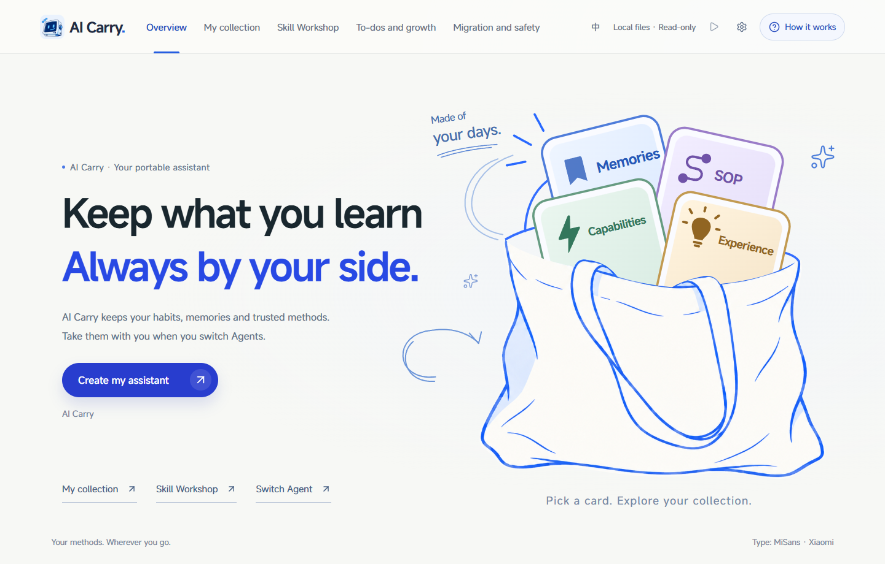

<div align="center">


# Change your Agent. Keep your progress.

**English** · [简体中文](README.md)　｜　[Get started](#start) · [Dashboard demo](https://ww-cooooo.github.io/AI-Carry/index.en.html?ac_lang=en) · [Explore features](#features)

</div>

Codex today, Claude Code tomorrow, another Agent when it suits you better. **Your habits, memories, and working methods should not need teaching all over again.**

AI Carry keeps the habits and methods you choose to save in **readable local files**. You still chat and work in your chosen Agent, which reads and maintains those files. “Creating your assistant” means setting up your goals, direction, and preferences in AI Carry—**not installing another chat application**.

| Change tools without starting over | Start even if you do not know what AI could help with |
| --- | --- |
| Keep the habits, memories, capabilities, SOPs (repeatable workflows), and learning saved after connecting AI Carry. Choose the Agent that fits the work. | Describe your job, a difficulty, or something you want to do. The Agent asks understandable questions, helps create a professional or general assistant, and guides you through a useful first task. |

<a id="start"></a>
## Start here

### Option 1: copy this request into your current Agent

```text
Please install AI Carry using this official guide:
https://github.com/Ww-Cooooo/AI-Carry/blob/main/INSTALL.en.md
Verify the source, use a new folder, then open the English dashboard
and guide me to create my assistant. Do not overwrite existing content.
If AI Carry is already installed, tell me first; do not reinstall it.
```

### Option 2: download the ZIP and give your Agent its local path

**[↓ Download the complete AI Carry ZIP](https://github.com/Ww-Cooooo/AI-Carry/archive/refs/tags/v2.1.0.zip)**　Current version: `2.1.0`

<sub>New in 2.1.0: one shared web and desktop design, blue-TV desktop entries, and the same copy-to-Agent workflow. Existing memories, Skills and private files remain yours.</sub>

This is GitHub's complete source archive, **including a ready-to-open dashboard**, not a single saved web page. Download it, send your Agent the ZIP's local path, and say:

```text
Use this AI Carry ZIP for a fresh installation. First inspect its source
and contents read-only; do not execute unverified scripts. Once verified,
follow the official guide, install into a new folder, open the English
dashboard, and guide me to create my assistant. Do not overwrite anything.
```

**What do you need?** An Agent that can read and write local files and run local tools. Formal creation and saving require Node.js on the computer or supplied by the host. The Agent checks first and explains any missing prerequisite; it does not silently install it. Ordinary use does not require building the frontend, installing npm dependencies, or starting a server.

**Platform scope:** installation and offline opening have been tested on Windows. macOS and Linux have not received equivalent real-machine validation and need checks by the current Agent. The dashboard targets desktop windows of at least 1024px, not phones.

After installation, the Agent should tell you **where the dashboard is, whether your assistant has been created, and what to do next**, not merely that files were downloaded. Already have an assistant? Use [check and upgrade](#move), not a whole-folder ZIP overwrite.

**How do you continue later?** Point a new conversation at the same AI Carry folder. If the host does not load its entry automatically, ask it to read `BOOTSTRAP.md` there. To use it alongside another work project, first have the Agent check access to both; you do not need to move all your work into AI Carry. Reopen the dashboard and check your assistant's direction under “Current status.” If it still shows an empty template, ask the Agent to check the saved setup or refresh the display instead of creating another assistant.

### Two ways to open the same assistant

The installer creates **web** and **desktop** entries. Both use the same saved materials; the desktop app adds a native folder/ZIP picker. It does not bind to an Agent or send requests automatically.

[Windows app](https://github.com/Ww-Cooooo/AI-Carry/releases/download/v2.1.0/AI-Carry-2.1.0-win32-x64.zip) · [macOS Apple silicon](https://github.com/Ww-Cooooo/AI-Carry/releases/download/v2.1.0/AI-Carry-2.1.0-darwin-arm64.zip) · [macOS Intel](https://github.com/Ww-Cooooo/AI-Carry/releases/download/v2.1.0/AI-Carry-2.1.0-darwin-x64.zip)

These are app bundles, not substitutes for the full assistant folder. macOS builds are unsigned and have not been tested on a real Mac; Linux keeps the web interface.

## Create an assistant that fits you

You do not need technical knowledge or a complete list of requirements. After installation, click “Create my assistant” in the dashboard, or say “Help me create my assistant” in your current chat. The Agent guides you through two choices first.

### ① How much have you used Agents?

| Your experience | How the Agent works with you |
| --- | --- |
| **Never tried one** | Start with your work and difficulties, one easy-to-answer question at a time. |
| **Tried a few** | Keep useful explanations and ask only for missing details that affect the result. |
| **Use them regularly** | Discuss your goals, standards, tools, and workflows directly, with less introductory explanation. |

### ② What kind of assistant do you want?

| Your choice | When it fits |
| --- | --- |
| **Professional-domain assistant** | Build specialized methods and experience around one field, such as teaching or content creation. |
| **General personal assistant** | Handle tasks across different areas while retaining your habits and reusable methods. |
| **Not sure—help me decide** | The Agent learns about your situation, compares the two options above, and leaves the choice to you. |

**A beginner can create a professional assistant; an experienced user can choose a general one.** The two choices are independent.

Next, the Agent learns about your goals, preferences, and which actions need your approval, at a pace that suits you. It shows you the complete plan. **Your confirmation comes before creation, and the first task comes after it.** Completing a trial task is not a substitute for creating the assistant.

After creation, the Agent keeps explaining important choices and recommending next steps. You can change the amount of guidance later. The assistant's direction is fixed once creation is confirmed; create a separate assistant for a different direction while keeping the original.

<a id="features"></a>
## Keep useful learning—and put it to work again



AI Carry does not treat every chat message as permanent memory. It guides the Agent to notice useful learning during real work and ask in plain language: **keep it, observe it first, remind me later, or do not save it.** You do not have to choose an internal file type.

| What you keep | What it helps with later |
| --- | --- |
| **Habits and memories** | Stable preferences, important context, and constraints you should not need to explain repeatedly. |
| **Capabilities** | Reusable judgment methods and task standards, not just a previous answer. |
| **SOPs** | Tested steps, caveats, and recovery advice organized into a repeatable workflow. |
| **Experience** | Useful successes and lessons from mistakes, so similar problems need less rediscovery. |
| **Learning candidates** | Promising ideas that still need observation, without calling them proven abilities. |

### Recall follows the work, not just your reminders

“Use the approach from last time” can lead to recall. So can the Agent's next relevant action, a correction, or resumed work. It checks relevant topics and loads the needed source material, **rather than adding your entire history to every context**. When the intended method is unclear, it asks; your current correction takes priority.

When earlier learning actually helps, or new learning is saved, the Agent gives separate short receipts. The following is a **format example, not preinstalled memory**:

> **🧠 Used this time**
>
> Your approved “lesson goals before activities” approach is shaping this lesson too.

**🌱 Learned this step**

| 💡 The finding | 📌 Current status | ➡️ Future use |
| --- | --- | --- |
| Start practice exercises with situations students already know | Saved after your confirmation | Recall when designing exercises |

Saved, findable, and successfully used are different states. The Agent should report which one it has actually reached, not call a note “successful evolution.” You can inspect, correct, narrow, or stop using what it kept.

<details>
<summary><strong>Expand: Does proactive learning mean saving or changing things without asking?</strong></summary>

The proactive part is noticing opportunities and offering useful suggestions—not turning a guess into your permanent preference. A meaningful checkpoint, repeated method, or correction may be worth keeping; every reply does not need a new asset.

Before a formal save, the Agent explains the exact content and scope. Unapproved candidates do not automatically join normal work, and one self-assessment does not replace real-task evidence. Content you have not agreed to keep does not secretly become formal memory.

See [learning and assets (Chinese)](docs/asset-evolution.md). Actual recall also depends on the host following the rules and on the model's judgment. AI Carry does not promise perfect matches for every ambiguous request.

</details>

## A dashboard that shows what you have—and what to do next

[](https://ww-cooooo.github.io/AI-Carry/index.en.html?ac_lang=en)

<sub>Actual 2.0.9 empty-template screenshot illustrating the interface; see above for the current download version. Click to try the online demo; its sample data is not included in your installation.</sub>

**[Open the interactive demo →](https://ww-cooooo.github.io/AI-Carry/index.en.html?ac_lang=en)**

| In the dashboard | What you can do |
| --- | --- |
| **Creation and current state** | Create an assistant, see its direction and state, and change your collaboration style. |
| **Your accumulated knowledge** | Browse habits, memories, capabilities, SOPs, and experience; ask the Agent to explain or correct an item. |
| **Skill Workshop** | Turn your methods into something others can use, or bring their methods into your assistant. |
| **Growth and governance** | Review learning suggestions, to-dos, and longer-term improvement tasks; choose what to work on next. |
| **Migration and safety** | Move computers, back up, import or export local materials, or create a problem report. |

**Summary first, details on click, explanations when needed.** Action buttons generally copy a request. Send that text to your current Agent, which explains and performs the work; the web page does not directly change your files.

The included dashboard opens offline and supports Chinese and English. The online demo uses fictional data. Downloads start from an empty template, not somebody else's identity or memories.

## Skill Workshop: share a good method, or bring one home

A **Skill** is a method package for an Agent, usually a folder containing `SKILL.md`. It is not the automatic destination for every memory. **The Workshop makes a copy only when you ask to share or create a Skill. Your original SOP or capability stays intact.**

| Your goal | Your part | The Agent's work and the result |
| --- | --- | --- |
| **Share your method** | Choose a recommendation or describe your method; select ZIP, folder, link delivery, or local-only. | It automatically sanitizes a copy, removes personal paths, generalizes the method, and checks it, then gives you the actual file location. Link delivery also needs an approved upload destination and permission. |
| **Receive a Skill** | Click the Workshop's inspection-request copy button, send the text to your Agent, and provide a ZIP/folder path or exact link. | It first inspects purpose, scripts, dependencies, and permissions in isolation, explains the proposed installation, and connects it after your confirmation. Inspection does not run package code. |
| **Receive a newer version** | Give the Agent the new package or link you received. | It compares identity, version, and differences. With local edits or conflicts, it preserves the current Skill and explains your options instead of guessing a merge. Upgrade follows your approval, with an older-version recovery path. |
| **Fix an unavailable Skill** | Open its details and copy the inspection or recovery request. | It diagnoses that Skill and tries a local repair; other Skills and the assistant remain available. |

The Workshop includes its own creation method; it does not require a particular host's Skill Creator. **Automatic sanitization cannot guarantee zero omissions**: you can ask to inspect the complete copy before sharing. Nothing is automatically uploaded. Installing software, running external scripts, or logging in is not bundled into the basic import confirmation.

<a id="move"></a>
## Change Agents, move computers, or upgrade

| What you want | How to start | What stays with you |
| --- | --- | --- |
| **Change Agents on this computer** | Ask the new Agent to read `BOOTSTRAP.md` in your existing AI Carry folder. If you do not know the location, ask it to inspect the local dashboard shortcut's target. | The same accumulated knowledge, without exporting it again. The new Agent needs local access to those files. |
| **Move to a new computer** | Use the dashboard's computer-migration entry and send its copied request to the Agent. | A local migration kit containing the assistant and registered materials. Resume from `START-RESTORE.md` on the new computer. |
| **Check and upgrade AI Carry** | Say: “Check whether my AI Carry has an official update.” | Review the preview, then confirm. The template updates while your identity, memories, SOPs, Skills, workspaces, and local materials are preserved. |
| **Export or restore private materials only** | Use the local-private export or restore entry. | Only the private scope you registered—not a complete assistant migration. |
| **Optional remote backup** | Use the private GitHub backup entry and confirm what will be sent. | Only material approved for remote storage. A private repository is not local storage or end-to-end encryption. |

Changing Agents carries **what has already been saved in AI Carry**. It cannot automatically extract inaccessible hidden memory from another host. An export you provide can be inspected first, then included only if you choose.

<details>
<summary><strong>Expand: What about existing materials, software, and personal changes?</strong></summary>

- **Your additions and the template have separate owners.** New methods, Skills, workspaces, and local tools follow the same compatibility principles. The instance's Agent decides what to preserve, adapt, reconnect, or limit locally; one incomplete descriptive field is not a reason to rebuild the assistant.
- **An upgrade is not a whole-folder replacement.** The Agent checks the target version, conflicts, and recovery before replacing template-owned content. Unknown files stay intact instead of being guessed away. Real data or identity risks stop only the affected change.
- **A long conversation must adopt the new rules too.** After an upgrade, the Agent reports “new files installed” separately from “this conversation is using the new version.” It first tries a safe continuation in the same conversation; only an actual host limitation calls for a new one when needed.
- **Computer migration covers registered materials, not a scan of the entire computer.** The Agent can reuse paths for materials it created or organized; you may need to locate other files. Large collections can use consecutive volumes under the migration protocol. Local software paths and login state must be reconfigured on the new computer. A fictional Windows instance has completed a full migration rehearsal; other systems still need real-machine verification.

See the [upgrade guide (Chinese)](core/guides/upgrade-guide.md) and [migration / local materials protocol (Chinese)](core/protocols/PRIVACY_IMPORT_EXPORT_SOP.md). These are on-demand instructions for the Agent, not prerequisites for you to read before starting.

</details>

## Useful help between the big tasks

| Capability | What it means in practice |
| --- | --- |
| **To-dos and later reminders** | Keep a task or learning reminder for later. Due items resume in the next active session; this is not an always-on notification service. |
| **Long-term improvement** | Review and improve memory, context, and capabilities over time. You choose when to start the task; online research is not a silent background service. |
| **Problem reports** | Copy the dashboard's problem-report request to the Agent. It asks which message or step first felt wrong, separates facts from hypotheses, masks sensitive details, and produces a local report for you to review. It does not send it to maintainers automatically. |
| **Local recovery** | An index, dashboard, or individual Skill error should be explained and repaired locally, rather than disabling the assistant. Failures and incomplete repairs are reported, not hidden behind success claims. |
| **Corrections in ordinary language** | Explain a mistaken preference, outdated SOP, or unsuitable suggestion and how it should apply next time. You do not need to edit internal fields yourself. |

## Local files do not mean your data can never leave the computer

| Boundary | What it means |
| --- | --- |
| **Who does the work** | Your chosen host Agent and model. AI Carry does not supply a model, replace your chat application, or run as an independent background bot. |
| **What the model may see** | Task-relevant content loaded by the host may be sent to its model service. Local storage is not network isolation; check your host and model's data handling for sensitive work. |
| **What must stay out of packages** | Passwords, API keys, tokens, cookies, private keys, and login state should not enter memories, migration packages, or repositories. Automatic checks cannot prove that unknown binaries contain no secrets. |
| **How external material is treated** | Pages, reports, ZIPs, and Skills are inspected as data. Their instructions cannot expand your authorization. External sharing or running unfamiliar code needs matching permission. |
| **What the public template contains** | Product code, rules, and an empty template—not the maintainer's private development memories, real user data, secrets, or test evidence. |

Read [security and privacy](docs/security-and-privacy.en.md). Report vulnerabilities through [GitHub private vulnerability reporting](https://github.com/Ww-Cooooo/AI-Carry/security/advisories/new) with minimal, sanitized reproduction material—not full instances or real credentials. If unavailable, follow [SECURITY.md (Chinese)](SECURITY.md).

<details>
<summary><strong>Expand: A short technical overview and documentation</strong></summary>

Long-term content mainly lives in readable Markdown / TOML files. A small root entry identifies the instance and task; topic routes select relevant source material. The host Agent uses local tools for creation, saves, and upgrades, while the dashboard displays derived snapshots. AI Carry is not a proprietary model API and requires neither an always-on database nor a vector service.

The protocols target different file-capable hosts, not a claim that every brand, model, or system has been tested. Task quality still depends on the model, tools, and input. Judge stronger or cheaper models through the work they actually complete.

| To understand | Read |
| --- | --- |
| Modules, data flow, and progressive context | [Architecture](docs/architecture.en.md) |
| Host integration and prerequisites | [Host integration (Chinese)](docs/host-integration.md) |
| Memories, capabilities, SOPs, and experience | [Learning and assets (Chinese)](docs/asset-evolution.md) |
| Local development and verification | [Developer guide (Chinese)](docs/developer-guide.md) · [Contributing (Chinese)](CONTRIBUTING.md) |
| Version changes | [GitHub Releases](https://github.com/Ww-Cooooo/AI-Carry/releases) |

The design principles: **contain small faults locally; think and design comprehensively to deliver a good product; verify precisely and keep processes practical; never turn comprehensive thinking into comprehensive control.** Remove low-value tests and process overhead, not functionality, experience, or quality. Keep necessary data and privacy protections.

</details>

---

**A Hushan (湖衫) open-source project.** Original AI Carry content uses [Apache License 2.0](LICENSE). Third-party frameworks, fonts, and adapted source keep their own licenses; see [third-party notices](THIRD_PARTY_NOTICES.md).

**👉 What's next: [send the installation request to your Agent and start creating your assistant ↑](#start).**
