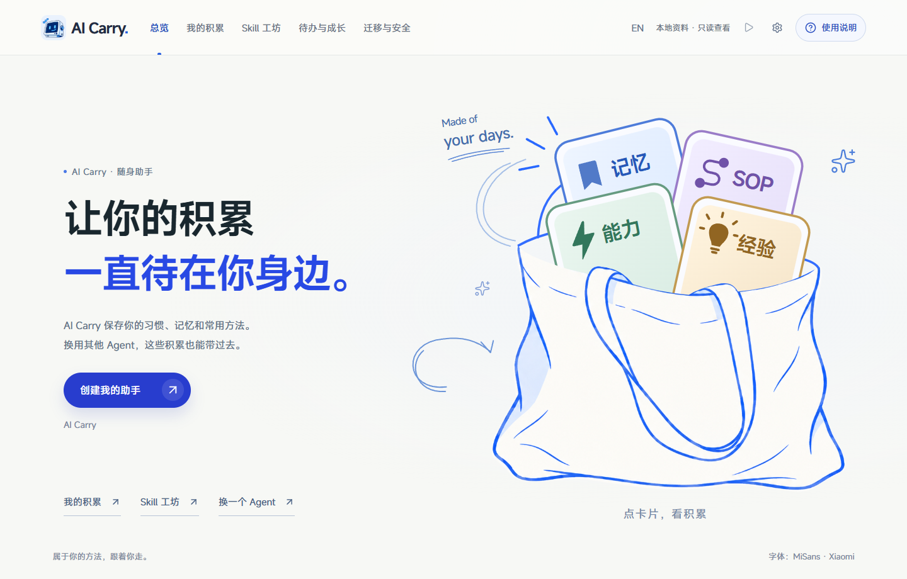

<div align="center">


# Agent 随你换，积累跟你走。

**简体中文** · [English](README.en.md)　｜　[立即安装](#start) · [看板演示](https://ww-cooooo.github.io/AI-Carry/) · [功能一览](#features)

</div>

今天用 Codex，明天换 Claude Code，遇到更合适的 Agent 就换。**你的习惯、记忆和做事方法，不必每次重新教。**

AI Carry 把你选择保留的习惯和方法存进**本地可读文件**。你仍在自己选的 Agent 里聊天和工作，由它读取、维护这份积累。“创建助手”是为 AI Carry 确定你的目标、方向和偏好，**不是再安装一个聊天软件**。

| 换工具，不重头开始 | 不知道 AI 能做什么，也能开始 |
| --- | --- |
| 带走接入后保存的习惯、记忆、能力、SOP（可复用的做事流程）和学习成果。哪个 Agent 更适合当下的任务，就用哪个。 | 说说你的职业、困难和想做的事。Agent 会逐步提问，帮你创建专业方向助手，或通用助手，再引导你完成第一件真正有用的任务。 |

<a id="start"></a>
## 现在就开始

### 方式一：复制这段话，发给你正在用的 Agent

```text
请按这份官方安装说明，为我安装 AI Carry：
https://github.com/Ww-Cooooo/AI-Carry/blob/main/INSTALL.md
先核对来源，在新目录安装并打开看板，然后引导我创建助手。
如果已经有 AI Carry，请先告诉我，不要重复安装或覆盖。
```

### 方式二：直接下载 ZIP，再把文件位置告诉 Agent

**[↓ 下载 AI Carry 完整 ZIP](https://github.com/Ww-Cooooo/AI-Carry/archive/refs/tags/v2.1.0.zip)**　当前版本：`2.1.0`

<sub>2.1.0：网页版与客户端换上同一套界面，桌面上可直接打开；点按钮复制请求，再发给你想用的 Agent。原有记忆、Skill 和私密资料继续保留。</sub>

这是 GitHub 的完整源码压缩包，**已带可直接打开的看板**，不是只下载一个网页。下载后，把 ZIP 的本地路径发给 Agent，并说：

```text
请用这个 AI Carry ZIP 做全新安装。先只读核对来源和包内文件，
不执行未经核验的脚本。确认后按官方安装说明安装到新目录，
打开看板，并引导我创建助手。不要覆盖已有内容。
```

**需要什么？** 一个能读写本地文件、执行本地工具的 Agent。正式创建和保存需要本机或宿主随带的 Node.js；Agent 会先检查，缺少时说明如何继续，不会悄悄安装。普通使用不需要自己构建前端、安装 npm 依赖或启动服务器。

**平台范围：** Windows 已完成安装与离线打开验收；macOS、Linux 尚未完成同等实机验收，需要当前 Agent 核对。看板优先服务电脑端（1024px 及以上），不承诺手机适配。

安装后，Agent 应告诉你**看板在哪、助手是否已创建、现在可以做什么**，而不只是说“文件已下载”。已有助手请走[检查与升级](#move)，不要用 ZIP 整包覆盖。

**以后怎么接着用？** 新开对话时，仍指向这份 AI Carry 目录；若宿主没有自动读取入口，就让它先读其中的 `BOOTSTRAP.md`。在其他业务项目中使用时，先让 Agent 确认能同时访问这份积累，不必一律搬动业务资料。重新打开看板后，可以在“当前状态”核对自己的助手方向；若仍显示空模板，先让 Agent 检查保存或刷新显示，不要重复创建。

### 同一份积累，两个打开方式

安装时，Agent 会在桌面放好 **AI Carry（网页版）** 和 **AI Carry（客户端）**。两者读取同一份助手资料；客户端还能直接选择本地文件夹和 ZIP。它不会自动连接 Agent，仍由你复制请求、粘贴发送。

[Windows 客户端](https://github.com/Ww-Cooooo/AI-Carry/releases/download/v2.1.0/AI-Carry-2.1.0-win32-x64.zip) · [Mac 苹果芯片](https://github.com/Ww-Cooooo/AI-Carry/releases/download/v2.1.0/AI-Carry-2.1.0-darwin-arm64.zip) · [Mac Intel](https://github.com/Ww-Cooooo/AI-Carry/releases/download/v2.1.0/AI-Carry-2.1.0-darwin-x64.zip)

客户端包不代替完整助手目录。Mac 包未签名、尚未完成 Mac 实机验收；Linux 继续使用网页版。

## 按你的情况，创建自己的助手

不用懂技术，也不用提前想好所有需求。安装后，在看板点击“创建我的助手”，或直接在当前聊天里说“帮我创建助手”。Agent 会先带你做两个选择。

### ① 你用过多少 Agent？

| 你的情况 | Agent 怎样配合你 |
| --- | --- |
| **还没用过** | 从你的工作和困难聊起，一次问一个好回答的问题。 |
| **用过一些** | 保留必要解释，只补问影响结果的关键信息。 |
| **已经很熟悉** | 直接讨论你的目标、标准、工具和流程，少讲入门内容。 |

### ② 你想要哪种助手？

| 你的选择 | 适合什么情况 |
| --- | --- |
| **专业领域助手** | 围绕教师、自媒体等一个职业或方向，积累专门的方法和经验。 |
| **通用个人助手** | 帮你处理不同领域的事情，记住你的习惯和常用方法。 |
| **还没想好，先帮我判断** | Agent 先了解你的情况，比较上面两种，再由你决定。 |

**没用过 Agent，也可以创建专业助手；用得很熟，也可以选择通用助手。** 两个选择并不绑定。

接着，Agent 会按适合你的节奏了解工作目标、习惯，以及哪些事需要先问你，再给你看一份完整方案。**你确认后才正式创建，创建完成后再开始第一项任务。** 不是随便做一次任务就算创建好了。

创建后，Agent 仍会解释关键选择、推荐下一步。引导多少可以随时调整；助手方向在确认创建后固定，想换一个完全不同的方向，可以另建一份，保留原来的助手。

<a id="features"></a>
## 越用越有积累，而且下次用得上



AI Carry 不把整段聊天都当成永久记忆。它引导 Agent 在真实工作中主动发现值得留下的东西，再用普通话和你确认：**留下、先观察、以后提醒，还是不保存。** 你不用自己选文件类型。

| 留下什么 | 以后怎样帮到你 |
| --- | --- |
| **习惯与记忆** | 记住稳定的偏好、重要背景和约束，减少反复解释。 |
| **能力** | 保存可复用的判断方法和任务标准，不只记住某次答案。 |
| **SOP** | 把验证过的步骤、注意事项和失败处理整理成可再次执行的流程。 |
| **经验** | 留下有价值的成功做法和错误教训，避免同类问题从头摸索。 |
| **学习候选** | 暂时有价值、但还没证实的想法先观察，不冒充成熟能力。 |

### 不只等你提醒，也看当前工作需要

你说“沿用上次的做法”，或 Agent 自己准备执行相关操作、处理纠正、接续任务时，都有按需查找旧积累的入口。它先看相关主题，再读需要的正文，**不是每次把全部历史塞进上下文**。不确定是哪一种方法时，先问清；你当前的纠正优先。

真正用上或形成了新学习，Agent 会分别给出简短回执。下面是**展示样式示例，不是内置记忆**：

> **🧠 这次用上了**
>
> 你之前确认的“教案先列目标、再排活动”，这次继续沿用。

**🌱 这一步我学到了**

| 💡 学到了什么 | 📌 现在的状态 | ➡️ 以后怎么用 |
| --- | --- | --- |
| 课堂练习先贴近学生熟悉的场景 | 经你确认后已保存 | 下次设计练习时按需调用 |

保存、能找到、实际用过，是不同的事。Agent 应如实说明完成到了哪一步，不能把一条想法写进文件就宣称“已经进化成功”。你可以查看、纠正、缩小适用范围或要求不再使用。

<details>
<summary><strong>点击展开：主动学习会不会变成乱记、乱改？</strong></summary>

主动的是发现机会和提出建议，不是擅自把推测变成你的长期偏好。自然阶段完成、重复做法出现或你纠正它时，Agent 会判断是否值得保留；不是每条回复都生成资产。

正式保存前会说明具体内容和适用范围。尚未确认的候选不会自动参与日常工作；一次自评也不能替代真实任务验证。你没有同意保存的内容，不会被偷偷当作正式记忆。

相关说明：[学习与资产](docs/asset-evolution.md)。实际召回仍取决于宿主执行规则和模型判断；AI Carry 不承诺每一种模糊说法都能百分之百命中。

</details>

## 看板：看得见，也知道下一步怎么做

[](https://ww-cooooo.github.io/AI-Carry/)

<sub>2.0.9 本地空模板实拍，用于展示界面；当前下载版本见上方。点击图片体验在线演示，示例数据不会随安装包带入。</sub>

**[打开在线演示 →](https://ww-cooooo.github.io/AI-Carry/)**

| 在看板里 | 你能做什么 |
| --- | --- |
| **创建与当前状态** | 创建助手，了解当前方向、状态，调整交流方式。 |
| **我的积累** | 查看习惯、记忆、能力、SOP 和经验；有疑问就让 Agent 解释或修改。 |
| **Skill 工坊** | 把自己的方法整理给别人用，也把别人分享的方法接进来。 |
| **成长与治理** | 查看学习建议、待办和长期改进任务，选择下一步要处理的事。 |
| **迁移与安全** | 换电脑、备份、导入导出本地资料，或生成一份问题报告。 |

**先看摘要，点开看详情，再按需看解释。** 看板里的操作按钮通常是“复制请求”：点击后把文字发给当前 Agent，由它说明并执行，不是网页直接修改电脑文件。

看板随包提供，可离线打开，支持中英文。在线演示使用虚构数据；你下载的是空模板，不会带着别人的身份和记忆。

## Skill 工坊：把好方法分享出去，也接住别人的好方法

这里的 **Skill** 是给 Agent 使用的一份方法包，通常是带 `SKILL.md` 的文件夹。它不是每条记忆的默认归宿：**只有你主动想分享或转为 Skill，工坊才制作副本，原来的 SOP 或能力不动。**

| 你想做什么 | 你做的事 | Agent 会做的事与结果 |
| --- | --- | --- |
| **分享自己的方法** | 选一项推荐，或直接说想分享什么；选择 ZIP、文件夹、链接交付或只留本地。 | 自动在副本上脱敏、去掉私人路径、整理成别人可用的方法，再检查；完成后给你实际文件位置。链接交付还需确认上传位置和权限。 |
| **导入别人的 Skill** | 在工坊点击“复制检查请求”，发给 Agent，再提供 ZIP／文件夹路径或准确链接。 | 先隔离查看用途、脚本、依赖和权限，说明要装什么；你确认后接入本实例。检查不等于运行包内程序。 |
| **导入同一 Skill 的新版** | 把收到的新版包或链接交给 Agent。 | 核对身份、版本和差异。有本地修改或冲突时，先保留现有 Skill、说明选项，不猜测合并；你确认方案后再升级，并保留旧版回退。 |
| **处理暂不可用的 Skill** | 打开卡片详情，复制检查或恢复请求。 | 定位这个 Skill 的问题并尝试局部修复；其他 Skill 和助手继续使用。 |

工坊自带创建方法，不要求先安装某一家 Agent 的 Skill Creator。**自动脱敏不等于保证零遗漏**：分享前可以让 Agent 展示完整副本。文件不会自动上传；安装软件、运行外来脚本或登录账号，也不是导入确认自动附送的权限。

<a id="move"></a>
## 换 Agent、换电脑、升级，各走各的简单入口

| 你要做的事 | 怎么开始 | 保留或带走什么 |
| --- | --- | --- |
| **同一电脑换 Agent** | 让新 Agent 读取原 AI Carry 文件夹里的 `BOOTSTRAP.md`。不知道目录时，让它检查本地看板快捷入口的目标。 | 沿用同一份积累，不必再导出一遍。新 Agent 需能访问这些本地文件。 |
| **换电脑** | 看板中选择准备换电脑，把复制的请求发给 Agent。 | 生成本地迁移套件，包含助手与登记范围内的资料；在新电脑从 `START-RESTORE.md` 接续。 |
| **检查与升级 AI Carry** | 对 Agent 说：“检查我的 AI Carry 有没有官方更新。” | 先看升级预览，再确认；更新模板部分，保留实例身份、记忆、SOP、Skill、工作区和本地资料。 |
| **只导出／恢复私密资料** | 使用看板的本地隐私导出／恢复入口。 | 只处理你登记的私密范围；它不是完整助手迁移。 |
| **可选远程备份** | 使用 GitHub 私有备份入口，并确认要发送的范围。 | 只上传允许远程存放的内容；私有仓库不等于本机，也不等于端到端加密。 |

换 Agent 带走的是 **AI Carry 中已经保存的内容**，不能自动提取旧宿主未开放的隐藏记忆。你提供的旧记忆导出件可以先供核对，再由你决定是否纳入。

<details>
<summary><strong>点击展开：已有很多资料、软件和个人改动，也能升级或迁移吗？</strong></summary>

- **个人积累和模板分开管理。** 实例的新方法、Skill、工作区或本机工具，沿用同一套兼容原则。Agent 根据实例实况决定保留、适配、重连或局部停用，不因为一个描述字段不完整就重建整个助手。
- **升级不是整目录覆盖。** 先核对目标版本、冲突和回退，再替换模板负责的内容。不能判断归属的文件保留，不猜测删除；遇到真实数据或身份风险，只停止受影响的改动。
- **长对话也需要接上新规则。** 升级后会分别报告“新文件已安装”和“当前对话已采用新版”。优先在当前对话安全接续；宿主确实无法重载时，说明限制，必要时再换新对话。
- **换电脑只带登记范围，不扫描整台电脑。** 当前 Agent 已经创建或整理的资料可复用已有路径；其他资料需要你帮助定位。大资料可以按迁移协议分卷，本机软件路径和登录状态需要在新电脑重新配置。Windows 虚构实例已做过完整迁移演练，其他系统仍需实机确认。

详见[升级指南](core/guides/upgrade-guide.md)与[迁移／本地资料说明](core/protocols/PRIVACY_IMPORT_EXPORT_SOP.md)。这些是 Agent 按需读取的说明，不是要求你先读完才能用。

</details>

## 还有这些日常会用到的帮助

| 能力 | 用起来是什么样 |
| --- | --- |
| **待办与稍后提醒** | 一件事暂时不做，可以留待办或学习提醒。到期后在下一次活跃会话接上，不冒充全天候后台通知。 |
| **长期改进** | 记忆、上下文与能力可以持续检视和改进；由你选择开展相关任务，联网调研不是悄悄运行的后台服务。 |
| **问题报告** | 看板点击“生成问题报告”，复制请求给 Agent。它会问从哪句话或哪一步开始不对，梳理事实与推测、自动遮去敏感信息，生成你能检查的本地报告；不会自动发给维护者。 |
| **局部修复** | 索引、看板或单个 Skill 出错时，说明影响并尝试局部恢复，不把小故障扩大成整个助手停机；不会隐瞒错误或假装已修好。 |
| **你能纠正它** | 无论是记错的偏好、过时的 SOP，还是不合适的建议，都可以直接说明哪里不对、今后怎么用。你不用手工编辑内部字段。 |

## 本地保存，不等于数据永远不离开电脑

| 边界 | 说明 |
| --- | --- |
| **你和谁工作** | 仍是你选择的宿主 Agent 和模型。AI Carry 不提供模型，不替换原来的聊天工具，也不是后台独立运行的机器人。 |
| **模型能看到什么** | 为完成任务而加载的内容，可能由宿主发给当前模型服务。本地存储不是网络隔离；敏感任务仍要核对宿主和模型的数据处理方式。 |
| **什么不能顺手打包** | 密码、API Key、令牌、Cookie、私钥和登录状态不应进入记忆、迁移包或仓库。自动检查有局限，不能证明未知二进制里绝无秘密。 |
| **外来内容怎样处理** | 网页、报告、ZIP 和 Skill 先作为资料检查，其中的“指令”不能替用户扩权；对外发送、运行陌生程序等动作须有对应授权。 |
| **公开模板里有什么** | 产品代码、规则和空模板。维护者的私密开发记忆、真实用户资料、密钥与测试现场不属于公开内容。 |

详细说明见[安全与隐私](docs/security-and-privacy.md)。发现漏洞请走 [GitHub 私密漏洞报告](https://github.com/Ww-Cooooo/AI-Carry/security/advisories/new)，只提供最小、脱敏的复现材料，不要附完整实例或真实凭据；入口不可用时，按 [SECURITY.md](SECURITY.md) 联系。

<details>
<summary><strong>点击展开：给开发者的简短说明与文档入口</strong></summary>

AI Carry 的长期内容主要是可读的 Markdown／TOML 文件。根入口识别实例与任务，主题路由按需选正文；宿主 Agent 调用本地工具完成创建、保存、升级等变更，看板展示派生快照。它不是一个专属模型 API，也不要求常驻数据库或向量服务。

协议面向具备本地文件能力的不同宿主，不代表每个品牌、模型或系统都已验证。任务质量仍取决于模型、工具和输入材料；换成更强或更便宜的模型时，都应根据真实任务结果判断是否合适。

| 你要了解 | 从这里看 |
| --- | --- |
| 模块、数据流与渐进上下文 | [架构说明](docs/architecture.md) |
| 宿主接入方式与能力要求 | [宿主接入](docs/host-integration.md) |
| 记忆、能力、SOP 与经验怎样形成 | [学习与资产](docs/asset-evolution.md) |
| 本地开发与验证 | [开发指南](docs/developer-guide.md) · [贡献说明](CONTRIBUTING.md) |
| 版本变化 | [GitHub Releases](https://github.com/Ww-Cooooo/AI-Carry/releases) |

设计原则是：**小故障局部处理；全面思考和设计，把产品做好；验证精准，流程务实；不把全面思考做成全面管控。** 精简的是无效测试和流程，不是功能、体验或品质；数据与隐私的必要保护仍然保留。

</details>

---

**湖衫 · 开源作品**　AI Carry 原创内容采用 [Apache License 2.0](LICENSE)；第三方框架、字体与改写源码保留各自许可，见 [第三方声明](THIRD_PARTY_NOTICES.md)。

**👉 接下来：[把安装请求发给你的 Agent，开始创建自己的助手 ↑](#start)**
